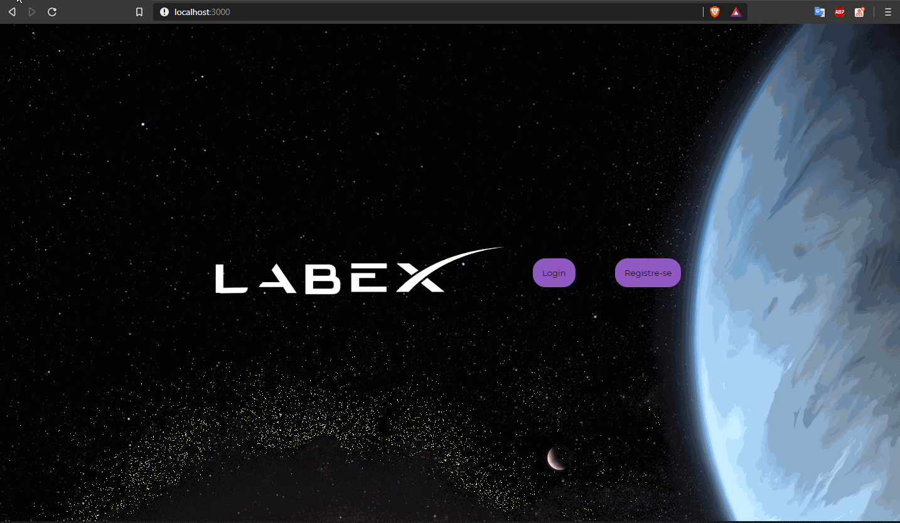

<h1 align="center">
   👨‍🚀 Front-end Web 👩‍🚀 SpaceX 🚀
</h1>
<p align="center">

  <br>

  <a href="https://www.linkedin.com/in/jonatan-machado/">
    
  </a>
</p>

---

<p align="center">
  
</p>

---

# Indice

- :rocket: [Sobre o Projeto](#rocket-sobre-o-projeto)
- 👨‍💻️ [Tecnogias utilizadas](#%EF%B8%8F-tecnogias-utilizadas)
- 📦️ [Como utilizar o projeto](#%EF%B8%8F-como-utilizar-o-projeto)
- 🤔️ [Como contribuir](#%EF%B8%8F-como-contribuir)

---

## :rocket: Sobre o Projeto

A proposta do **SpaceX** da [Labenu](https://labenu.com.br/) é desenvolver uma aplicação de viagens espaciais onde nos comunicamos com uma api, para cadastro de usuarios e viagens e para aprovação de viagens.

Este projeto de Front-end Web foi desenvolvido em ReactJS com TS.

---

## 👨‍💻️ Tecnogias utilizadas

O projeto foi desenvolvido utilizando as seguintes tecnologias:

- [ReactJS](https://reactjs.org/)
- [TypeScript](https://www.typescriptlang.org/)

### Dependências

- [JS-Base64](https://www.npmjs.com/package/js-base64)
- [React Router DOM](https://github.com/ReactTraining/react-router#readme)
- [React-Toastify](https://fkhadra.github.io/react-toastify/introduction)
- :nail_care: [Styled Components](https://styled-components.com/)

### Padronização de código

- [ESLint](https://eslint.org/)
- [Prettier](https://prettier.io/)
- :mouse: [Editor Config](https://editorconfig.org/)

### IDE

- [Visual Studio Code](https://code.visualstudio.com/)

---

## 📦️ Como utilizar o projeto

Para copiar o projeto, utilize os comandos:

```bash
  # Clonar o repositório
  ❯ git clone https://github.com/joninter/labe-x.git
```

Para instalar as dependências e iniciar o projeto, você pode utilizar o Yarn ou NPM:

**Utilizando yarn**

```bash
  # Instalar as dependências
  ❯ yarn

  # Iniciar o projeto
  ❯ yarn start
```

**Utilizando npm**

_PS: Caso utilize o NPM, apague o arquivo `yarn.lock` para ter todas as dependências instaladas da melhor forma._

```bash
  # Instalar as dependências
  ❯ npm install

  # Iniciar o projeto
  ❯ npm start
```

---

## 🤔️ Como contribuir

1. Faça o `fork` deste repositório
2. Crie uma branch com sua feature:
   - `$ git checkout -b minha_feature`
3. Confirme sua branch:
   - `$ git commit -m "feature: Meu novo recurso"`
4. Envie sua branch:
   - `$ git push origin minha_feature`

---

<h4 align="center">
  Feito com ❤️ por Jonatan Machado 👋️ <a href="mailto:jonatanmachado35@gmail.com">Entre em contato!</a>
</h4>

<p align="center">
  <a href="https://www.linkedin.com/in/jonatan-machado/">
    
  </a>
  <a href="https://www.facebook.com/jonatan.machado68">
    
  </a>
  <a href="https://www.instagram.com/jonatan.machado/">
    
  </a>
  <a href="https://twitter.com/joninter">
    
  </a>
</p>
